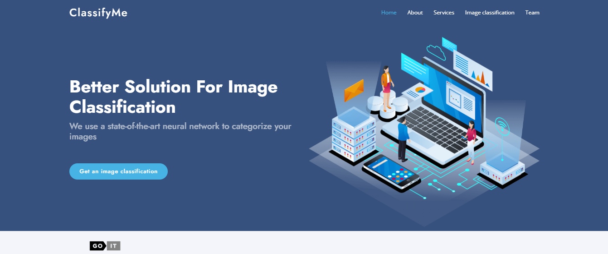

# ClassifyMe - Image Classification Web Service

## Introduction
ClassifyMe is a web-based image classification service built on the Django web platform, using TensorFlow and other dependencies. The goal of the project is to classify images for a client who creates unlabeled images, helping his model learn to create new images. The project is configured to work in a Docker container.

## Technologies
Project is mainly based on:
- **Web framework:** Django
- **Frontend:** HTML/CSS, framework Bootstrap, JavaScript
- **Backend:** Python

## System Requirements
- Docker
- Docker Compose
- Python 3.12

## Installation
1. **Clone the repository:**
   git clone https://github.com/alenaporoskun/Group_4_Image_Classification_Web_Service.git

2. **Create a Docker image:**
   docker-compose build

3. **Run the Docker container:**
   docker-compose up

## Settings

1. **Install dependencies with Poetry:**
   **Make sure Poetry is installed on your system. If not, install it using:**
   pip install poetry

2. **Install dependencies:**
   poetry install

3. **Set environment variables:**
   Create an .env file in the root of the project and add the necessary environment variables if needed.

## Using

1. **Start the server:**
   **If you run the project locally without Docker:**
   poetry run python manage.py runserver

   **If you run the project in a Docker container:**
   docker-compose up

2. **Access to the service:**
   Open your browser and follow the link http://127.0.0.1:8000/

   You should see the main page.

